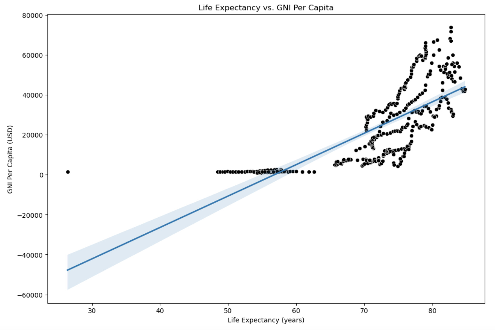

# Project 1: An Analysis of Global Sugar Consumption

The National Institutes of Health is conducting research on the impact of sugar consumption on global health and economy. The goal of the project is to understand the intricate relationships between sugar consumption, life expectancy, and Gross National Income (GNI) per capita across diverse countries. By examining these relationships, this study seeks to provide valuable insights for public health initiatives, policy-making, and economic decision-making, offering actionable information that spans across regions and socioeconomic statuses.

This study examines a sample of six different countries on six different continents (one country on each continent) between the years of 1961 and 2018 (inclusive) in order to understand important trends and relationships between different factors that affect human health and national economy. Because of a historical health concern that heavy sugar intake is detrimental to human health, the objective of this project is to answer necessary questions to make informed recommendations that may affect the future of sugar consumption and whether or not the benefits outweigh the risks.

# Contents:
- [Project Title](#Project-1:-An-Analysis-of-Global-Sugar-Consumption)
- [Data Dictionary](#Data-Dictionary)
- [Executive Summary](#Executive-Summary)

# Data Dictionary

|Feature|Type|Dataset|Description|
|---|---|---|---|
|country|object|gni_per_cap_atlas_method_con2021.csv, life_expectancy.csv, sugar_per_person_g_per_day.csv, merged_data.csv|The name of the country being observed|
|{Year}_gni|float|gni_per_cap_atlas_method_con2021.csv, merged_data.csv|GNI per capita in USD in a country in a specific year|
|{Year}_life|float|life_expectancy.csv, merged_data.csv|Life expectancy in a country in a specific year|
|{Year}_sugar|float|sugar_per_person_g_per_day.csv, merged_data.csv|Sugar in grams per person per day in a country in a specific year|

# Executive Summary

Sugar consumption can impact the health of people around the world as well as the economy of many nations. The goal to understand how sugar consumption affects life expectancy and GNI per capita and vice-versa is important to make informed decisions regarding public health and economic policy. To do this, it is necessary to examine a sample of the countries from around the world to observe the varying relationships.

In order to achieve the goals of this project, necessary libraries and data from multiple sources were imported. The data was then cleaned and merged. Summary statistics were calculated and an extensive exploratory data analysis was conducted of the cleaned data. The data was then visualized using a combination of heatmaps, histograms, boxplots, scatter plots, bar graphs, and line graphs. Once the data was visualized, conclusions and recommendations were then made and potential future studies were considered.

**Datasets**
- life_expectancy.csv: Life Expectancy by Country
- gni_per_cap_atlas_method_con2021.csv: Gross National Income (GNI)
- sugar_per_person_g_per_day.csv: Sugar in grams per person per day

**Initial Trends in Data**
- Country with the highest sugar consumption in 1961: Australia
- Country with the lowest sugar consumption in 1961: Cameroon
- Country with the highest sugar consumption in 2018: United States
- Country with the lowest sugar consumption in 2018: Cameroon
- Country with the highest life expectancy in 1961: Australia
- Country with the lowest life expectancy in 1961: Cameroon
- Country with the highest life expectancy in 2018: Japan
- Country with the lowest life expectancy in 2018: Cameroon
- Country with the highest GNI per capita in 1961: United States
- Country with the lowest GNI per capita in 1961: Cameroon
- Country with the highest GNI per capita in 2018: United States
- Country with the lowest GNI per capita in 2018: Cameroon
- United States has the highest average sugar consumption.
- Japan has the highest average life expectancy.
- United States has the highest average GNI per capita.

**Results**

**Conclusions and Recommendations**
- Moderate positive correlation between sugar consumption and GNI
- Wealthier countries tend to have higher sugar consumption
- Slight positive correlation between sugar consumption and life expectancy
- Although the data shows that there is a slight positive correlation between sugar consumption and life expectancy, other factors need to be considered that can affect life expectancy as well
- Strong positive correlation between life expectancy and GNI
- Countries with higher economic status tend to have longer life expectancy
- Moderation is still key since excessive sugar intake can lead to various health issues
- Individuals should be encouraged to consume other foods to maintain a balanced and healthy lifestyle
- Remember: correlation does not imply causation!

**Limitations and Future Studies**
- This study was limited to the data from six countries
- This study was limited to the time frame between 1961 and 2018 (inclusive)
- Future studies should include expanding both the countries and the time frame to include a larger sample size
- Future studies should also explore other factors that can affect life expectancy

**Sources**
- Gapminder datasets (https://www.gapminder.org/data/):
  - Life Expectancy by Country (life_expectancy.csv)
  - Gross National Income (GNI) per capita in current US dollars (gni_per_cap_atlas_method_con2021.csv)
  - Sugar in grams per person per day (sugar_per_person_g_per_day.csv)
- Website (Bloomberg Global Health Index): https://worldpopulationreview.com/country-rankings/healthiest-countries
